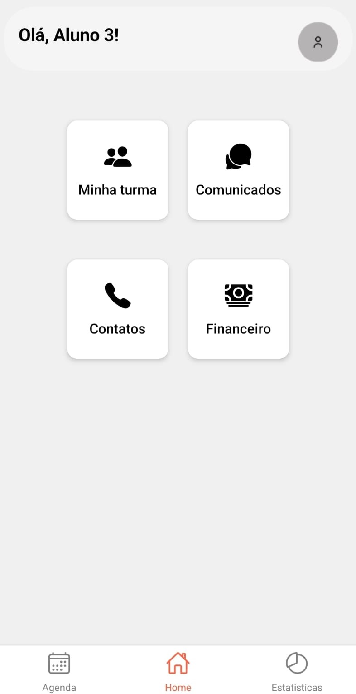
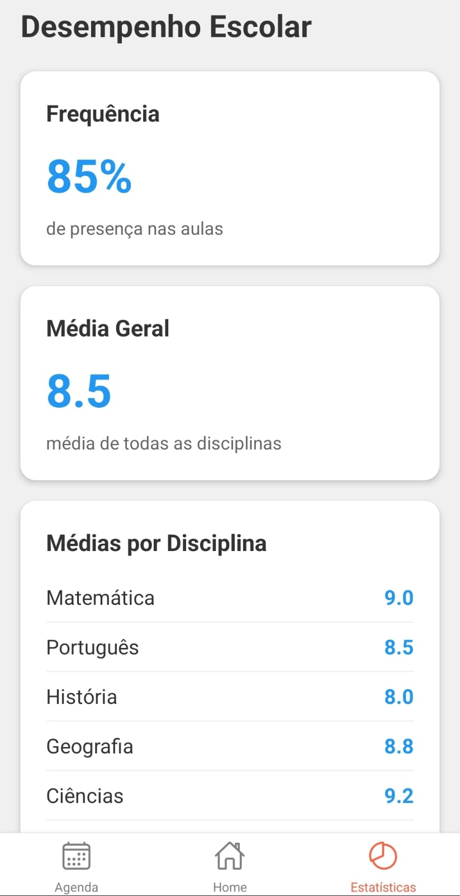

# Mediotech Senac

<div style="display: flex; justify-content: center;">
  
  
  
</div>

## Descrição
Projeto desenvolvido para a disciplina de Desenvolvimento Web do curso de Desenvolvimento de Sistemas do Senac. Mediotech é uma plataforma de gerenciamento escolar. Esta etapa do projeto foi desenvolvida para o aluno onde ele pode acompanhar o seu histórico acadêmico.

<br>

## Instalação
Instruções passo a passo sobre como instalar e configurar o projeto localmente.

<br>

## Tecnologias
- Expo
- React Native
- React Native

<br>

## Instalação

```bash
# Clone o repositório
git clone 

# Navegue até o diretório do projeto
cd nome-do-projeto

# Instale as dependências
npm install

# Inicie o servidor de desenvolvimento
npx expo start

# Ler QRCode com o app Expo Go
```

<br>

### Contrinuição

Fique à vontade para contribuir com o projeto Mediotech.